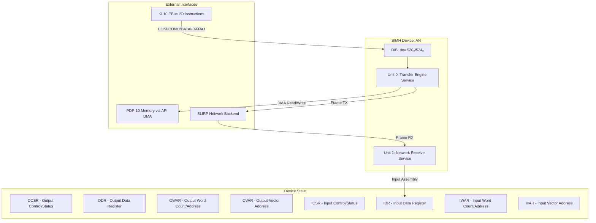
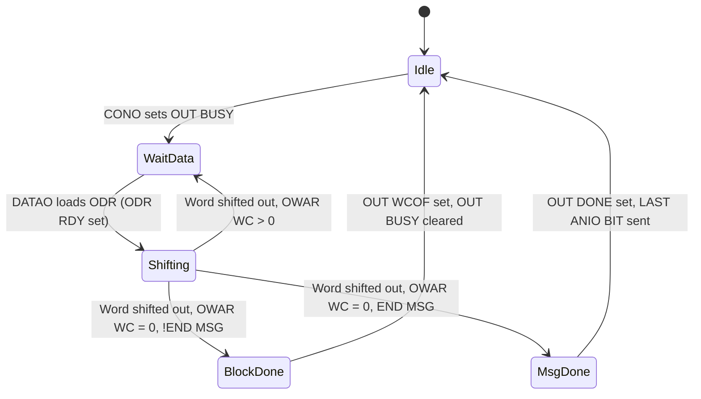
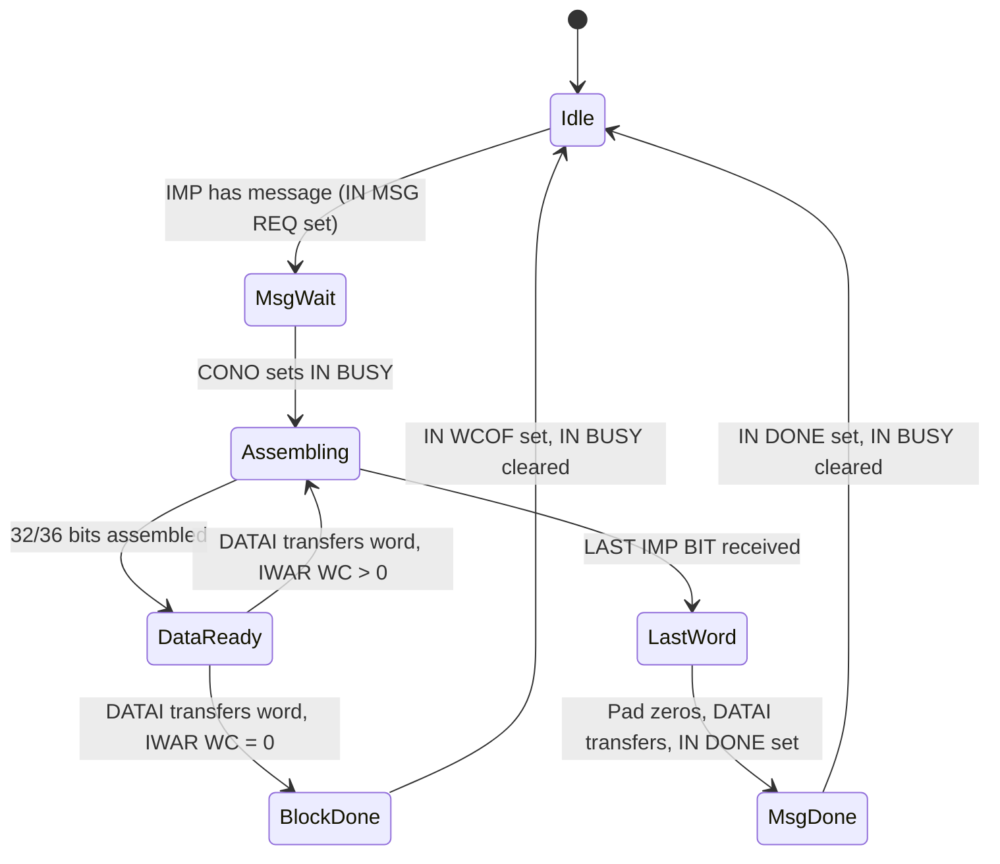

# Requirements Document

## Introduction

This document specifies the requirements for adding AN10/AN20 ARPANET Interface device support to the PDP-10 KL10 simulator within the SIMH framework. The AN10/AN20 is a DEC-manufactured hardware interface (EK-ANI/ZTM, 1978) that connects the KL10 external I/O bus (EBus) to an ARPA Interface Message Processor (IMP) for ARPANET connectivity. The new device (`kl10_an.c`) emulates the full-duplex, bit-serial interface with DMA block transfers, vector interrupts, and IMP handshake protocol support.

## Glossary

- **AN_Device**: The SIMH device structure representing the AN10/AN20 ARPANET Interface hardware
- **EBus**: The KL10 external I/O bus used for device communication
- **IMP**: Interface Message Processor — the ARPANET packet switch that the AN10/AN20 connects to
- **OCSR**: Output Control/Status Register — controls and reports status of output transfers
- **ODR**: Output Data Register — 36-bit shift register holding data for transmission to the IMP
- **OWAR**: Output Word Count/Address Register — contains 12-bit word count and 18/23-bit data address for output DMA
- **OVAR**: Output Vector Address Register — contains vector address for output status interrupts and diagnostic control bits
- **ICSR**: Input Control/Status Register — controls and reports status of input transfers
- **IDR**: Input Data Register — 36-bit shift register holding data received from the IMP
- **IWAR**: Input Word Count/Address Register — contains 12-bit word count and 18/23-bit data address for input DMA
- **IVAR**: Input Vector Address Register — contains vector address for input status interrupts and diagnostic control bits
- **API**: Automatic Priority Interrupt — the KL10 interrupt mechanism
- **DMA**: Direct Memory Access — cycle-stealing memory transfers without software intervention
- **DIB**: Device Information Block — SIMH structure registering device number, I/O handler, and interrupt handler
- **SLIRP**: User-mode TCP/IP stack used for network connectivity in simulation
- **Handshake_Protocol**: The demand/response signaling protocol (two-way or four-way) used to transport bit-serial data between the AN10/AN20 and the IMP

## Requirements

### Requirement 1: Device Registration and Initialization

**User Story:** As a simulator developer, I want the AN10/AN20 to register as a standard SIMH device, so that it integrates with the pdp10-kl simulator infrastructure.

#### Acceptance Criteria

1. THE AN_Device SHALL register with SIMH using a DIB structure specifying device codes 520₈ (output) and 524₈ (input)
2. THE AN_Device SHALL define UNIT, REG, MTAB, and DEVICE structures following existing KL10 device conventions
3. WHEN the simulator initializes, THE AN_Device SHALL set all programmable registers (OCSR, ODR, OWAR, OVAR, ICSR, IDR, IWAR, IVAR) to their reset state
4. THE AN_Device SHALL be conditionally compiled using `#if NUM_DEVS_AN > 0` with `NUM_DEVS_AN` defined as 1 under the `#if KL` section of kx10_defs.h
5. THE AN_Device SHALL expose all eight programmable registers as SIMH REG entries for examination and deposit

### Requirement 2: I/O Instruction Handling

**User Story:** As a PDP-10 operating system, I want to execute CONI, CONO, DATAI, and DATAO instructions to the AN10/AN20, so that I can control message transfers and read device status.

#### Acceptance Criteria

1. WHEN a CONI instruction is executed on device code 520₈, THE AN_Device SHALL return the current contents of the OCSR
2. WHEN a CONI instruction is executed on device code 524₈, THE AN_Device SHALL return the current contents of the ICSR
3. WHEN a CONO instruction is executed on device code 520₈, THE AN_Device SHALL update the OCSR bits according to the set/clear semantics defined in the hardware specification
4. WHEN a CONO instruction is executed on device code 524₈, THE AN_Device SHALL update the ICSR bits according to the set/clear semantics defined in the hardware specification
5. WHEN a DATAO instruction is executed, THE AN_Device SHALL write data to the register selected by the REGISTER SELECT bits (OCSR bits 28-29 for output, ICSR bits 28-29 for input)
6. WHEN a DATAI instruction is executed, THE AN_Device SHALL read data from the register selected by the REGISTER SELECT bits
7. WHEN a DATAO loads the ODR with OCSR OUT BUSY set, THE AN_Device SHALL set the ODR RDY flag and clear OUT DATA REQ

### Requirement 3: Output Transfer Engine

**User Story:** As a PDP-10 operating system, I want to transmit ARPANET messages through the AN10/AN20 output section, so that the host can send data to the IMP.

#### Acceptance Criteria

1. WHEN CONO sets OUT BUSY (OCSR bit 26), THE AN_Device SHALL initiate an output transfer by setting OUT DATA REQ (OCSR bit 22) to request the first data word
2. WHEN a DATAO loads a word into the ODR, THE AN_Device SHALL decrement the OWAR word count by one and increment the OWAR data address by one
3. WHEN the OWAR word count decrements to zero, THE AN_Device SHALL set OUT WCOF (OCSR bit 24) and clear OUT BUSY (OCSR bit 26)
4. WHEN OUT WCOF is set and END MSG (OCSR bit 27) is also set, THE AN_Device SHALL additionally set OUT DONE (OCSR bit 23) and assert the LAST ANIO BIT signal to the IMP
5. WHEN OUT MODE 36 (OCSR bit 25) is set, THE AN_Device SHALL pack 36 bits of message data per host word
6. WHEN OUT MODE 36 is cleared, THE AN_Device SHALL pack 32 bits of left-justified message data per host word
7. WHEN OUT BUSY is cleared, THE AN_Device SHALL set the REGISTER SELECT bits to 01 (selecting OWAR) in preparation for loading a new word count and address

### Requirement 4: Input Transfer Engine

**User Story:** As a PDP-10 operating system, I want to receive ARPANET messages through the AN10/AN20 input section, so that the host can receive data from the IMP.

#### Acceptance Criteria

1. WHEN CONO sets IN BUSY (ICSR bit 26), THE AN_Device SHALL initiate an input transfer and begin accepting data bits from the IMP
2. WHEN 32 bits (or 36 bits in 36-bit mode) have been assembled in the IDR, THE AN_Device SHALL assert IN DATA REQ (ICSR bit 22) to request a DATAI transfer to memory
3. WHEN a DATAI transfers a word from the IDR, THE AN_Device SHALL decrement the IWAR word count by one and increment the IWAR data address by one
4. WHEN the IWAR word count decrements to zero, THE AN_Device SHALL set IN WCOF (ICSR bit 24) and clear IN BUSY (ICSR bit 26)
5. WHEN the IMP asserts LAST IMP BIT, THE AN_Device SHALL pad the remaining bits of the current word with zeros, set IN DONE (ICSR bit 23), and generate a status interrupt
6. WHEN IN MODE 36 (ICSR bit 25) is set, THE AN_Device SHALL assemble 36 bits of message data per host word
7. WHEN IN MODE 36 is cleared, THE AN_Device SHALL assemble 32 bits of left-justified message data per host word

### Requirement 5: API Interrupt Generation

**User Story:** As a PDP-10 operating system, I want the AN10/AN20 to generate proper API interrupts, so that the CPU can service data transfers and status changes with minimal overhead.

#### Acceptance Criteria

1. WHEN OUT STD INT (OVAR bit 12) is cleared and a status condition occurs (OUT DONE or OUT WCOF), THE AN_Device SHALL generate an API function 2 (vector) interrupt using the address from the OVAR vector address field
2. WHEN OUT STD INT is cleared and OUT DATA REQ is set, THE AN_Device SHALL generate an API function 4 (DATAO) interrupt using the address from the OWAR data address field
3. WHEN IN STD INT (IVAR bit 12) is cleared and a status condition occurs (IN DONE or IN WCOF), THE AN_Device SHALL generate an API function 2 (vector) interrupt using the address from the IVAR vector address field
4. WHEN IN STD INT is cleared and IN DATA REQ is set, THE AN_Device SHALL generate an API function 5 (DATAI) interrupt using the address from the IWAR data address field
5. WHEN OUT STD INT (OVAR bit 12) is set, THE AN_Device SHALL generate KAIO-style (function type 1) interrupts on the STATUS PI CHANNEL (OCSR bits 30-32) and DATA PI CHANNEL (OCSR bits 33-35)
6. WHEN IN STD INT (IVAR bit 12) is set, THE AN_Device SHALL generate KAIO-style (function type 1) interrupts on the STATUS PI CHANNEL (ICSR bits 30-32) and DATA PI CHANNEL (ICSR bits 33-35)
7. WHEN OUT KIIO API (OVAR bit 11) is set, THE AN_Device SHALL use 18-bit address pointers (KIIO format) for vector and DATAO interrupt addresses
8. WHEN OUT KIIO API (OVAR bit 11) is cleared, THE AN_Device SHALL use 23-bit address pointers with QUALIFIER (KLIO format) for vector and DATAO interrupt addresses

### Requirement 6: IMP Handshake Protocol

**User Story:** As a simulator developer, I want the AN10/AN20 to emulate the IMP handshake protocol, so that message data is correctly framed and transferred between the host and the simulated IMP.

#### Acceptance Criteria

1. WHEN four-way handshake mode is selected (default), THE AN_Device SHALL require four cable transactions of the READY FOR BIT/YOUR BIT control signals per data bit transfer
2. WHEN two-way handshake mode is selected, THE AN_Device SHALL require two cable transactions of the READY FOR BIT/YOUR BIT control signals per data bit transfer
3. WHEN IMP MASTER READY is deasserted during a message transfer, THE AN_Device SHALL pause data transmission until IMP MASTER READY is reasserted
4. WHEN IMP MASTER READY is lost and then restored, THE AN_Device SHALL resume the transfer without generating an interrupt
5. THE AN_Device SHALL give input priority over output when both directions contend for IMP resources
6. WHEN the IMP asserts LAST IMP BIT concurrent with YOUR IMP BIT, THE AN_Device SHALL recognize end-of-message and pad the final word with zeros

### Requirement 7: Network Backend Connectivity

**User Story:** As a simulator user, I want the AN10/AN20 to connect to a real or simulated network, so that the emulated ARPANET host can exchange messages with other systems.

#### Acceptance Criteria

1. THE AN_Device SHALL support SLIRP as a network backend for NAT-based TCP/IP connectivity
2. THE AN_Device SHALL frame outgoing IMP messages according to the BBN Report 1822 message format before passing them to the network backend
3. WHEN a network packet is received from the backend, THE AN_Device SHALL present it to the input section as a properly framed IMP message with leader and padding
4. THE AN_Device SHALL support configurable host address and IMP number via SIMH SET commands
5. IF the network backend is unavailable or disconnected, THEN THE AN_Device SHALL report IMP NOT READY status in the ICSR

### Requirement 8: Diagnostic Loopback Mode

**User Story:** As a diagnostic program, I want to use the AN10/AN20 internal loopback modes, so that I can verify device operation without a real IMP connection.

#### Acceptance Criteria

1. WHEN MAINT MODE (OCSR bit 20) and IMP PORT DISABLED (OCSR bit 19) are both set, THE AN_Device SHALL enable diagnostic maintenance functions
2. WHEN OUT LOOP (OVAR bit 05) is set with MAINT MODE and IMP PORT DISABLED, THE AN_Device SHALL internally connect output handshake signals to self-sustain data output for the message duration
3. WHEN LOOP BACK (OVAR bit 06) is set, THE AN_Device SHALL route output data directly to the input section, creating a complete output-to-input loopback path
4. WHEN IN LOOP (IVAR bit 05) is set with MAINT MODE and IMP PORT DISABLED, THE AN_Device SHALL internally generate input handshake signals to self-sustain data input
5. WHEN diagnostic loopback is active, THE AN_Device SHALL simulate IMP MASTER READY assertion approximately 425 ms after enabling the loop mode

### Requirement 9: Data Mode Switching

**User Story:** As a PDP-10 operating system, I want to switch between 32-bit and 36-bit data modes at message block boundaries, so that I can handle different message formats within a single transfer.

#### Acceptance Criteria

1. WHEN OUT WCOF is set (word count reaches zero), THE AN_Device SHALL clear OUT MODE 36 (OCSR bit 25) to allow mode reselection for the next block
2. WHEN IN WCOF is set (word count reaches zero), THE AN_Device SHALL clear IN MODE 36 (ICSR bit 25) to allow mode reselection for the next block
3. WHEN a new block transfer is initiated by setting OUT BUSY, THE AN_Device SHALL use the data mode specified concurrently in the same CONO instruction
4. THE AN_Device SHALL support changing data mode at any block boundary within a multi-block message without affecting message integrity

### Requirement 10: Build System Integration

**User Story:** As a simulator developer, I want the AN10/AN20 source file to be integrated into the build system, so that it compiles as part of the pdp10-kl target.

#### Acceptance Criteria

1. THE AN_Device source file (kl10_an.c) SHALL be listed in the pdp10-kl target SOURCES in CMakeLists.txt
2. THE AN_Device SHALL compile without errors or warnings when `KL=1` is defined
3. THE AN_Device SHALL coexist with the existing kx10_imp.c device without conflicts (different device codes, independent state)
4. THE AN_Device SHALL include `sim_ether.h` for network backend support

### Requirement 11: SIMH User Interface

**User Story:** As a simulator user, I want to configure and monitor the AN10/AN20 device through standard SIMH commands, so that I can set up network parameters and diagnose issues.

#### Acceptance Criteria

1. THE AN_Device SHALL support SET AN MAC=xx:xx:xx:xx:xx:xx for configuring the network MAC address (when using Ethernet-based backends)
2. THE AN_Device SHALL support SET AN IP=x.x.x.x for configuring the host IP address
3. THE AN_Device SHALL support SET AN IMPNO=n for configuring the IMP number
4. THE AN_Device SHALL support SET AN HOSTNO=n for configuring the host number on the IMP
5. THE AN_Device SHALL support SHOW AN STATUS to display current device state including register contents and transfer status
6. WHEN the device is attached (ATTACH AN), THE AN_Device SHALL initialize the network backend connection
7. WHEN the device is detached (DETACH AN), THE AN_Device SHALL cleanly shut down the network backend and deassert IMP MASTER READY

# Design Document: AN10/AN20 ARPANET Interface for PDP-10 KL10 Simulator

## Overview

This design describes the implementation of the AN10/AN20 ARPANET Interface device (`kl10_an.c`) for the PDP-10 KL10 simulator within the SIMH framework. The AN10/AN20 is a DEC-manufactured hardware interface (EK-ANI/ZTM, 1978) that connects the KL10 external I/O bus (EBus) to an ARPA Interface Message Processor (IMP) for ARPANET connectivity.

The implementation emulates:
- Full-duplex, bit-serial IMP interface with DMA block transfers
- Two independent device sections (output at 520₈, input at 524₈)
- Eight programmable registers (OCSR, ODR, OWAR, OVAR, ICSR, IDR, IWAR, IVAR)
- API vector interrupts (functions 2, 4, 5) with KIIO/KLIO format support
- 32-bit and 36-bit data modes with per-block switching
- IMP handshake protocol (two-way and four-way)
- Diagnostic loopback modes (OUT LOOP, IN LOOP, LOOP BACK)
- SLIRP network backend for NAT-based TCP/IP connectivity

The device follows established SIMH conventions as demonstrated by `kl10_nia.c` (KL10 EBus device patterns) and `kx10_imp.c` (IMP protocol and SLIRP integration).

## Architecture

The AN10/AN20 device is implemented as a single SIMH device with multiple service units handling different aspects of the transfer engine:



### Design Decisions

1. **Single source file**: All device logic resides in `sims/PDP10/kl10_an.c` following the naming convention of `kl10_nia.c`, `kl10_fe.c`, `kl10_dn.c`.

2. **Word-level DMA simulation**: The hardware performs bit-serial transfers with per-bit handshaking. The simulator abstracts this to word-level DMA operations triggered by the service routine, since bit-level timing is not observable by software.

3. **Two SIMH units**: Unit 0 handles the output/input transfer engine (activated when OUT BUSY or IN BUSY is set). Unit 1 handles asynchronous network receive polling.

4. **Shared DIB with dual device codes**: The DIB registers device code 520₈ with a span of 2 (covering 520₈ and 524₈). The I/O handler dispatches based on `(dev - an_dib.dev_num) / 4` to distinguish output (0) from input (1) sections.

5. **SLIRP backend reuse**: Network connectivity uses the same `sim_ether.h` / ETH_DEV infrastructure as `kx10_imp.c`, with IMP message framing per BBN Report 1822.

6. **Interrupt generation via existing API**: The KL10 simulator's `set_interrupt()` / `clr_interrupt()` mechanism is used for KAIO-style interrupts. For KLIO vector/DATAO/DATAI interrupts, the `an_irq()` handler constructs the appropriate API function word.

## Components and Interfaces

### 1. Device Registration (`an_dev`, `an_dib`)

```c
DIB an_dib = { AN_DEVNUM, 2, &an_devio, &an_irq, NULL };

DEVICE an_dev = {
    "AN", an_unit, an_reg, an_mod,
    2, 8, 0, 1, 8, 36,
    NULL, NULL, &an_reset, NULL, &an_attach, &an_detach,
    &an_dib, DEV_DISABLE | DEV_DIS | DEV_DEBUG | DEV_ETHER, 0, an_debug,
    NULL, NULL, &an_help, NULL, NULL, &an_description
};
```

- `AN_DEVNUM` = 0520 (octal)
- `num_devs` = 2 (covers output 520₈ and input 524₈)
- I/O handler: `an_devio(uint32 dev, uint64 *data)`
- IRQ handler: `an_irq(uint32 dev, t_addr addr)`

### 2. I/O Handler (`an_devio`)

Dispatches CONI, CONO, DATAI, DATAO for both device sections:

```c
t_stat an_devio(uint32 dev, uint64 *data) {
    int section = (dev - AN_DEVNUM) / 4;  // 0=output, 1=input
    switch (dev & 03) {
        case CONI: ...
        case CONO: ...
        case DATAI: ...
        case DATAO: ...
    }
}
```

**Output section (520₈)**:
- CONI: Returns OCSR contents
- CONO: Updates OCSR with set/clear semantics; triggers state transitions (OUT BUSY, RESET, etc.)
- DATAI: Reads register selected by OCSR bits 28-29 (ODR, OWAR, OVAR)
- DATAO: Writes register selected by OCSR bits 28-29

**Input section (524₈)**:
- CONI: Returns ICSR contents
- CONO: Updates ICSR with set/clear semantics; triggers state transitions (IN BUSY, CLR IMP WAS DOWN, RESET, etc.)
- DATAI: Reads register selected by ICSR bits 28-29 (IDR, IWAR, IVAR)
- DATAO: Writes register selected by ICSR bits 28-29

### 3. Interrupt Handler (`an_irq`)

Generates API function words for KLIO/KIIO vector interrupts:

```c
t_addr an_irq(uint32 dev, t_addr addr) {
    // Determine interrupt source (output status, output data, input status, input data)
    // Construct API function word:
    //   Function 2 (vector): address from OVAR/IVAR vector field
    //   Function 4 (DATAO): address from OWAR data address field
    //   Function 5 (DATAI): address from IWAR data address field
    // Apply KIIO (18-bit) or KLIO (23-bit + qualifier) format
}
```

### 4. Output Transfer Engine (`an_out_svc`)

State machine driven by `sim_activate()`:



Key behaviors:
- Setting OUT BUSY sets OUT DATA REQ and generates data interrupt
- DATAO to ODR clears OUT DATA REQ, sets ODR RDY, decrements OWAR word count, increments OWAR address
- When word count reaches zero: sets OUT WCOF, clears OUT BUSY and OUT MODE 36
- If END MSG was set: additionally sets OUT DONE and signals LAST ANIO BIT to IMP
- Register select bits auto-set to 01 (OWAR) when OUT BUSY clears

### 5. Input Transfer Engine (`an_in_svc`)

State machine for receiving IMP data:



Key behaviors:
- IN MSG REQ set on first bit of incoming message (status interrupt)
- Setting IN BUSY enables bit assembly into IDR
- When 32 (or 36) bits assembled: sets IN DATA REQ, generates data interrupt
- DATAI from IDR clears IN DATA REQ, decrements IWAR word count, increments IWAR address
- When word count reaches zero: sets IN WCOF, clears IN BUSY and IN MODE 36
- On LAST IMP BIT: pads remaining bits with zeros, issues final DATAI, then sets IN DONE
- Register select bits auto-set to 01 (IWAR) when IN BUSY clears

### 6. Network Backend (`an_attach`, `an_detach`, `an_eth_svc`)

Uses `sim_ether.h` ETH_DEV for SLIRP connectivity:

- `an_attach()`: Opens ETH device via `eth_open()`, sets MAC filter, initializes SLIRP
- `an_detach()`: Closes ETH device via `eth_close()`, deasserts IMP MASTER READY
- `an_eth_svc()`: Polls for incoming packets, converts IP frames to IMP message format with 1822 leader

### 7. IMP Message Framing

Outgoing (host → IMP):
1. Software writes message blocks via output transfer engine
2. On OUT DONE (complete message), the accumulated data is extracted
3. The 96-bit IMP leader (per BBN 1822) is parsed to determine message type, destination host/IMP
4. The payload is wrapped in an IP packet and sent via SLIRP

Incoming (IMP → host):
1. Network backend receives IP packet
2. An IMP leader (96 bits) is prepended based on source address and message type
3. Data is presented to input section bit-by-bit (simulated at word granularity)
4. LAST IMP BIT is asserted with the final data bit

### 8. Diagnostic Loopback

Three loopback modes controlled by OVAR/IVAR bits with MAINT MODE and IMP PORT DISABLED:

| Mode | OVAR/IVAR Bits | Behavior |
|------|---------------|----------|
| OUT LOOP | OVAR bit 04 | Output handshake self-sustains; data shifts out without real IMP |
| IN LOOP | IVAR bit 04 | Input handshake self-sustains; data from IVAR IMP TO ANIO DATA |
| LOOP BACK | OVAR bit 06 | Output data routed directly to input section |

All modes simulate IMP MASTER READY assertion ~425 ms after enabling.

## Data Models

### Device State Structure

```c
struct an_device {
    /* Output section registers */
    uint64      ocsr;           /* Output Control/Status Register */
    uint64      odr;            /* Output Data Register (36-bit shift register) */
    uint64      owar;           /* Output Word Count/Address Register */
    uint64      ovar;           /* Output Vector Address Register */

    /* Input section registers */
    uint64      icsr;           /* Input Control/Status Register */
    uint64      idr;            /* Input Data Register (36-bit shift register) */
    uint64      iwar;           /* Input Word Count/Address Register */
    uint64      ivar;           /* Input Vector Address Register */

    /* Transfer engine state */
    int         out_bit_pos;    /* Current bit position in output word */
    int         in_bit_pos;     /* Current bit position in input word */
    int         imp_ready;      /* IMP MASTER READY state */
    int         imp_was_down;   /* IMP WAS DOWN latch */
    int         loopback_mode;  /* Active loopback mode (0=none, 1=out, 2=in, 3=full) */

    /* Message buffers */
    uint8       out_msg[8192];  /* Output message accumulation buffer */
    int         out_msg_len;    /* Current output message length in bits */
    uint8       in_msg[8192];   /* Input message buffer */
    int         in_msg_len;     /* Input message length in bits */
    int         in_msg_pos;     /* Current input position in bits */

    /* Network backend */
    ETH_DEV     etherface;      /* Ethernet device handle */
    ETH_MAC     mac;            /* MAC address */
    ETH_QUE     ReadQ;          /* Receive queue */
    ETH_PACK    rec_buff;       /* Receive buffer */
    ETH_PACK    snd_buff;       /* Send buffer */

    /* Configuration */
    uint32      ip_addr;        /* Host IP address */
    uint16      imp_no;         /* IMP number */
    uint16      host_no;        /* Host number on IMP */
};
```

### Register Bit Definitions (Key Fields)

**OCSR (Output Control/Status Register) — 36 bits:**

| Bits | Name | Description |
|------|------|-------------|
| 00 | RDY FOR ANIO BIT | IMP ready for next output bit (read-only) |
| 01 | YOUR ANIO BIT | ANIO presenting bit to IMP (read-only) |
| 06-11 | Output Shift Counter | Bits shifted from ODR (read-only) |
| 15 | OUT MSG BUSY | Message transfer in progress |
| 16 | ODR RDY | Output Data Register has data |
| 17 | LAST ANIO BIT | Last bit being transmitted |
| 18 | IMP PORT DISABLED | Disables IMP cable drivers (CONO set/clear) |
| 19 | MAINT MODE | Enables diagnostic functions (CONO set/clear) |
| 22 | OUT DATA REQ | Ready for new data word (generates data interrupt) |
| 23 | OUT DONE | Message transmission complete (generates status interrupt) |
| 24 | OUT WCOF | Word count overflow — block complete |
| 25 | OUT MODE 36 | 36-bit data mode (cleared when OUT BUSY clears) |
| 26 | OUT BUSY | Output transfer active |
| 27 | END MSG | This block is last block of message |
| 28-29 | REGISTER SELECT | Selects ODR(00), OWAR(01), OVAR(10) for DATAO/DATAI |
| 30-32 | STATUS PI CHANNEL | PI channel for status interrupts |
| 33-35 | DATA PI CHANNEL | PI channel for data interrupts |

**ICSR (Input Control/Status Register) — 36 bits:**

| Bits | Name | Description |
|------|------|-------------|
| 00 | RDY FOR IMP BIT | ANIO ready to receive bit from IMP (read-only) |
| 01 | YOUR IMP BIT | IMP presenting bit (read-only) |
| 02 | IMP TO ANIO DATA | Current data bit from IMP (read-only) |
| 03 | LAST IMP BIT | Last bit indicator from IMP (read-only) |
| 04 | DISTANT CONNECTION | Distant cable interface enabled (switch, read-only) |
| 05 | LOCAL CONNECTION | Local cable interface enabled (switch, read-only) |
| 06-11 | Input Shift Counter | Bits shifted into IDR (read-only) |
| 12 | IN 32 BITS | 32+ bits assembled in IDR |
| 13 | IN 36 BITS | 36 bits assembled in IDR |
| 15 | LOOPBACK CONNECTOR | Loopback test connector installed (read-only) |
| 16 | IN MSG BUSY | Input message in progress |
| 18 | IMP WAS DOWN | IMP ready line flapped (latched) |
| 19 | ~IMP READY | IMP not ready (inverted: 1 = IMP down) |
| 22 | IN DATA REQ | Assembled word ready for DATAI (generates data interrupt) |
| 23 | IN DONE | Message reception complete (generates status interrupt) |
| 24 | IN WCOF | Word count overflow — block complete |
| 25 | IN MODE 36 | 36-bit data mode (cleared when IN BUSY clears) |
| 26 | IN BUSY | Input transfer active |
| 27 | IN MSG REQ | IMP has message available (status interrupt) |
| 28-29 | REGISTER SELECT | Selects IDR(00), IWAR(01), IVAR(10) for DATAO/DATAI |
| 30-32 | STATUS PI CHANNEL | PI channel for status interrupts |
| 33-35 | DATA PI CHANNEL | PI channel for data interrupts |

**OVAR/IVAR (Vector Address Registers) — 36 bits:**

| Bits | Name (OVAR) | Name (IVAR) |
|------|-------------|-------------|
| 00 | RDY FOR ANIO BIT (diag) | (undefined) |
| 01 | BIT AVL (read-only) | YOUR IMP BIT (diag) |
| 02 | — | IMP TO ANIO DATA (diag) |
| 03 | — | LAST IMP BIT (diag) |
| 04 | OUT LOOP | IN LOOP |
| 05 | OUT S CYC | IN S CYC |
| 06 | LOOP BACK | YOUR IMP BIT UP (read-only) |
| 07 | — | IZA DATA (read-only) |
| 08 | — | LAST IMP BIT RCVD (read-only) |
| 09 | — | 2WAY HANDSHAKE |
| 10 | — | ANIO READY |
| 11 | OUT KIIO API | IN KIIO API |
| 12 | OUT STD INT | IN STD INT |
| 13-35 | Vector Address (18 or 23 bit) | Vector Address (18 or 23 bit) |

**OWAR/IWAR (Word Count/Address Registers) — 36 bits:**

| Bits | Name | Description |
|------|------|-------------|
| 00 | (KLIO only) | Not used in KIIO format |
| 00 | QUALIFIER (KLIO) | Protection/relocation bit for API function word |
| 01-12 | WORD COUNT | 12-bit block size in host words (decrements) |
| 13-17 | (KLIO only) | Extended address bits (not gated in KIIO) |
| 18-35 | DATA ADDRESS | 18-bit data address (increments); 13-35 for KLIO 23-bit |


## Correctness Properties

*A property is a characteristic or behavior that should hold true across all valid executions of a system — essentially, a formal statement about what the system should do. Properties serve as the bridge between human-readable specifications and machine-verifiable correctness guarantees.*

### Property 1: CONI returns current CSR contents

*For any* device section (output or input) and *for any* valid CSR state, executing a CONI instruction SHALL return the exact current contents of that section's control/status register (OCSR for 520₈, ICSR for 524₈).

**Validates: Requirements 2.1, 2.2**

### Property 2: CONO set/clear semantics preserve invariants

*For any* initial CSR state and *for any* CONO operand value, the resulting CSR state SHALL reflect the correct application of set/clear semantics: bits designated as "set by CONO" are set when the operand bit is 1, bits designated as "cleared by CONO" are cleared when the operand bit is 0, and read-only bits remain unchanged.

**Validates: Requirements 2.3, 2.4**

### Property 3: DATAO/DATAI register select round-trip

*For any* register select value (00, 01, 10) and *for any* 36-bit data value, writing data via DATAO to the selected register and then reading it back via DATAI with the same register select SHALL return the original data value (masked to the appropriate width for the register).

**Validates: Requirements 2.5, 2.6**

### Property 4: Word count decrement and address increment

*For any* valid OWAR/IWAR state with word count > 0, a data transfer (DATAO to ODR for output, DATAI from IDR for input) SHALL decrement the word count field by exactly one and increment the data address field by exactly one, with no other fields modified.

**Validates: Requirements 3.2, 4.3**

### Property 5: Word count overflow terminates block transfer

*For any* transfer direction and *for any* message data, when the word count decrements to zero: (a) WCOF SHALL be set, (b) BUSY SHALL be cleared, (c) MODE 36 SHALL be cleared, (d) REGISTER SELECT SHALL be set to 01, and (e) if END MSG was set (output only), OUT DONE SHALL additionally be set.

**Validates: Requirements 3.3, 3.4, 4.4, 9.1, 9.2**

### Property 6: Data mode determines bits per word

*For any* host word of data, when MODE 36 is set the transfer engine SHALL process all 36 bits of the word, and when MODE 36 is cleared the transfer engine SHALL process only the leftmost 32 bits (with bits 32-35 ignored on output, zero-filled on input).

**Validates: Requirements 3.5, 3.6, 4.6, 4.7**

### Property 7: LAST IMP BIT zero-pads and terminates

*For any* bit position within a word (1 to 31 in 32-bit mode, 1 to 35 in 36-bit mode) at which LAST IMP BIT is asserted, the remaining unfilled bit positions in the current IDR word SHALL be padded with zeros, and IN DONE SHALL be set after the final DATAI transfer.

**Validates: Requirements 4.5, 6.6**

### Property 8: API function word construction

*For any* vector address register value and *for any* word count/address register value, the generated API function word SHALL contain: (a) the correct function code (2 for status vector, 4 for DATAO, 5 for DATAI), (b) the address from the appropriate register (OVAR/IVAR for vector, OWAR/IWAR for data), and (c) the correct address width (18-bit when KIIO API is set, 23-bit with qualifier when KIIO API is cleared).

**Validates: Requirements 5.1, 5.2, 5.3, 5.4, 5.7, 5.8**

### Property 9: KAIO-style interrupts use correct PI channels

*For any* PI channel assignment (0-7) in the STATUS PI CHANNEL and DATA PI CHANNEL fields, when STD INT is set, status conditions SHALL generate interrupts on the STATUS PI CHANNEL and data conditions SHALL generate interrupts on the DATA PI CHANNEL.

**Validates: Requirements 5.5, 5.6**

### Property 10: Diagnostic loopback round-trip

*For any* message data of arbitrary length, when LOOP BACK mode is enabled (MAINT MODE + IMP PORT DISABLED + OVAR LOOP BACK + IVAR ANIO READY), data written through the output transfer engine SHALL appear identically at the input transfer engine, preserving all bits and message boundaries.

**Validates: Requirements 8.2, 8.3, 8.4**

### Property 11: IMP message framing round-trip

*For any* valid IMP message payload, framing the payload into a network packet (with BBN 1822 leader) and then deframing the received packet back into an IMP message SHALL produce the original payload with correct leader fields reflecting source/destination addressing.

**Validates: Requirements 7.2, 7.3**

### Property 12: Data mode switching at block boundaries preserves message integrity

*For any* multi-block message where the data mode (32-bit or 36-bit) changes between blocks, the complete reassembled message data SHALL be identical to the original message data, with each block correctly using the mode specified in the CONO that initiated that block's transfer.

**Validates: Requirements 9.3, 9.4**

## Error Handling

### IMP Communication Errors

| Condition | Detection | Response |
|-----------|-----------|----------|
| IMP MASTER READY lost | IZA IMP MASTER READY deasserted | Set ICSR IMP WAS DOWN (bit 18), set ICSR ~IMP READY (bit 19), pause all transfers |
| IMP MASTER READY restored | IZA IMP MASTER READY reasserted (after 425ms debounce) | Clear ICSR ~IMP READY, resume transfers, do NOT generate interrupt |
| Network backend unavailable | `eth_open()` fails or connection lost | Set ICSR ~IMP READY, return SCPE_NOATT on attach |
| Network backend detached | User executes DETACH AN | Close ETH device, deassert IMP MASTER READY, set IMP WAS DOWN |

### Transfer Errors

| Condition | Detection | Response |
|-----------|-----------|----------|
| DATAO to ODR without OUT BUSY | ODR RDY not set (OUT BUSY check) | Data written to ODR but no transfer initiated; no interrupt generated |
| IN BUSY set without IN MSG REQ | Software error | Transfer starts but no data available; will stall until IMP sends data |
| Word count loaded as 0 | OWAR/IWAR WC field = 0 | Immediate WCOF on first transfer; single-word block |
| RESET during active transfer | CONO bit 19 (ICSR) or IOB RESET | All registers cleared, all transfers aborted, IMP WAS DOWN set |

### Diagnostic Mode Errors

| Condition | Detection | Response |
|-----------|-----------|----------|
| Loop mode without MAINT MODE | OVAR/IVAR loop bits written without MAINT MODE | Writes ignored; loop bits not set |
| Loop mode without IMP PORT DISABLED | Loop bits written without IMP PORT DISABLED | Writes ignored for bits requiring IMP PORT DISABLED |
| LOOP BACK without ANIO READY | OVAR LOOP BACK set but IVAR ANIO READY not set | IMP READY not simulated; handshake signals not gated |

### SIMH Framework Errors

| Condition | Detection | Response |
|-----------|-----------|----------|
| Attach without IP address | `imp_data.ip == 0` at attach time | Return SCPE_NOATT with error message |
| MAC address conflict | `eth_check_address_conflict()` fails | Return SCPE_NOATT, close ETH device |
| Memory access error | Invalid DMA address | Set appropriate error flags (implementation-specific) |

## Testing Strategy

### Unit Tests (Example-Based)

Unit tests verify specific scenarios and edge cases:

1. **Device initialization**: Reset sets all registers to zero/default state
2. **CONO OUT BUSY initiation**: Setting OUT BUSY asserts OUT DATA REQ
3. **Register select auto-switch**: OUT BUSY clearing sets register select to 01
4. **IMP READY status**: Detached device reports IMP NOT READY
5. **Diagnostic mode gating**: Loop bits only writable with MAINT MODE + IMP PORT DISABLED
6. **IMP READY debounce**: Loopback simulates 425ms delay before IMP READY assertion
7. **IMP WAS DOWN latch**: IMP ready flap sets and latches IMP WAS DOWN
8. **IN MSG REQ on first bit**: First input bit sets IN MSG REQ status interrupt

### Property-Based Tests

Property-based tests use the [fast-check](https://github.com/dubzzz/fast-check) library (JavaScript/TypeScript) or a C-based PBT framework to verify universal properties. Each test runs a minimum of 100 iterations with randomly generated inputs.

The device logic (register manipulation, state machine transitions, data packing, interrupt generation) will be extracted into testable pure functions where possible, enabling property-based testing without full SIMH infrastructure.

**Test configuration:**
- Minimum 100 iterations per property
- Each test tagged with: `Feature: kl10-an10-arpanet-interface, Property {N}: {title}`

**Properties to implement:**
1. CONI returns current CSR contents
2. CONO set/clear semantics preserve invariants
3. DATAO/DATAI register select round-trip
4. Word count decrement and address increment
5. Word count overflow terminates block transfer
6. Data mode determines bits per word
7. LAST IMP BIT zero-pads and terminates
8. API function word construction
9. KAIO-style interrupts use correct PI channels
10. Diagnostic loopback round-trip
11. IMP message framing round-trip
12. Data mode switching at block boundaries preserves message integrity

### Integration Tests

Integration tests verify end-to-end behavior with the full SIMH framework:

1. **Build verification**: `kl10_an.c` compiles without errors/warnings with `KL=1`
2. **Device coexistence**: Both AN and IMP devices load without conflicts
3. **SLIRP connectivity**: Attach/detach cycle with SLIRP backend
4. **DDANA diagnostic compatibility**: Internal loopback passes basic data patterns (mirrors hardware acceptance test)
5. **Multi-block message transfer**: Complete output message with multiple blocks and mode switches
6. **IMP ready line handling**: Transfer pause/resume on IMP READY loss/restoration

### Test Environment

- All tests compiled and executed inside the Docker container (linux/amd64)
- Build command: `docker compose run --rm dev make pdp10-kl`
- Property tests can be implemented as a separate test binary linked against the device logic functions
- Integration tests use SIMH's built-in scripting capability with `EXPECT`/`SEND` commands
